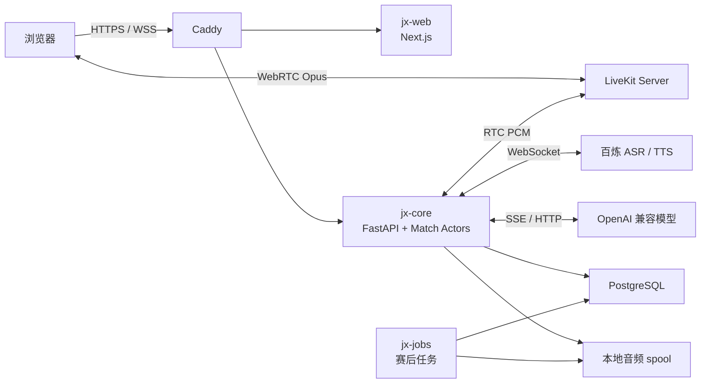
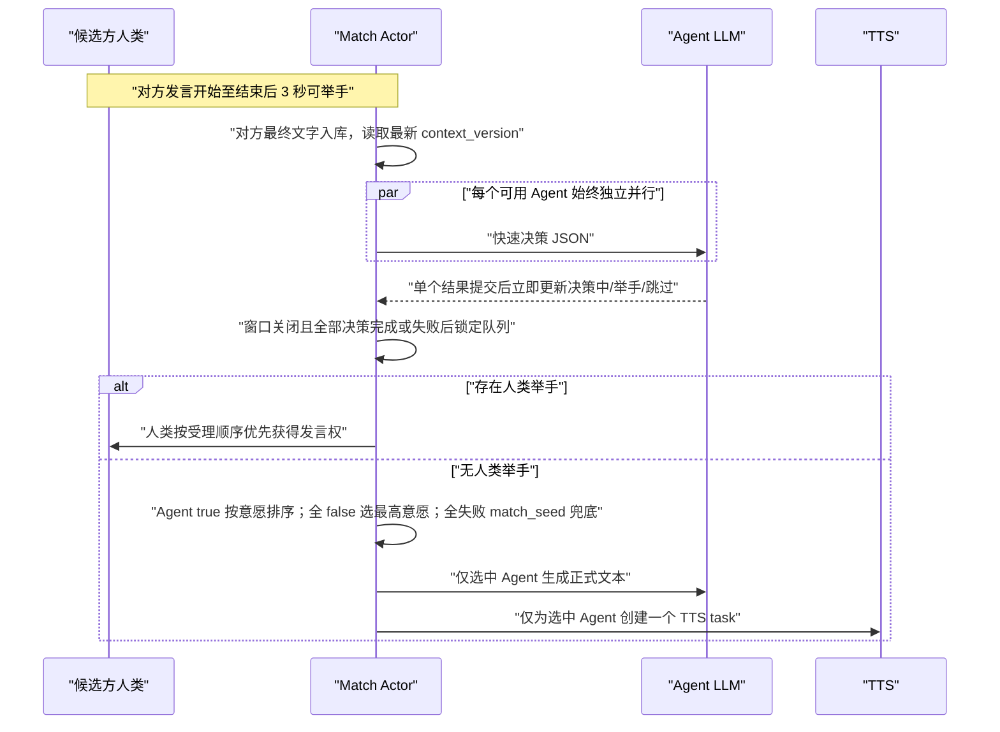

# 稷下人机自动辩论实验平台 MVP 技术设计

> 状态：已确认，可进入实施  
> 日期：2026-08-03
> 对应需求：`稷下人机自动辩论实验平台需求文档.md`  
> 语音实测：`docs/research/realtime-voice-spike-2026-07-24.md`

## 1. 设计目标

本设计服务于一台小型云服务器上的 MVP，优先级依次为：

1. 比赛状态和发言权正确，故障可见、可暂停、可恢复。
2. ASR、LLM、TTS 形成低延迟的真实流式链路。
3. 同时稳定承载最多 5 场进行中或暂停的比赛。
4. 结构简单，单机可部署、可诊断，后续可以拆分但不提前分布式化。
5. 用户操作直观；视觉实现以后续确认的设计稿为准。

MVP 不解决多机高可用、自动备份、视频、移动端专项适配、跨区域容灾、知识库和联网检索。

## 2. 核心决策

| 领域 | 决策 |
|---|---|
| 架构 | 模块化单机；一个权威编排进程，不使用 Redis、Kafka、Kubernetes |
| Web | Next.js、TypeScript、Tailwind CSS、shadcn/ui、Framer Motion、Lucide |
| 服务端 | FastAPI、Pydantic v2、SQLAlchemy 2 async、psycopg 3、Alembic |
| RTC | 自托管 LiveKit；只承载音频媒体，不承载比赛业务命令 |
| 数据 | PostgreSQL 保存业务状态、关键事件和异步任务；本地文件系统保存音频 |
| ASR | `fun-asr-realtime`；16 kHz 单声道 PCM；同一次发言内透明轮换短 task |
| TTS | `qwen-audio-3.0-tts-flash`；32 kbps Ogg Opus；PyAV 增量解码后送 LiveKit |
| LLM | OpenAI 兼容流式接口；全局硬并发 50；不自动切换模型 |
| 登录 | PostgreSQL 服务端 Session + HttpOnly Cookie；不向前端发 JWT |
| 部署 | Caddy + systemd；手工受控部署；不以 Docker Compose 为默认方式 |

### 2.1 为什么不使用 Redis

MVP 只有一个 `jx-core` 编排实例，所有活动比赛 Actor 都在同一进程内，不存在跨节点协调。PostgreSQL 已能承担持久化 Session、比赛快照、关键事件、任务队列和并发名额锁定；实时瞬态状态由内存 Actor 管理。加入 Redis 会增加部署、数据一致性和故障恢复路径，却不解决当前约束下的真实问题。

只有在出现多编排节点、LiveKit 多节点、独立实时 Worker 集群或跨节点发布订阅需求时再引入 Redis。

## 3. 系统结构



### 3.1 运行进程

| 进程 | 数量 | 职责 |
|---|---:|---|
| `jx-web` | 1 | 用户端、比赛页和管理后台 |
| `jx-core` | 严格 1 | HTTP、业务 WebSocket、比赛 Actor、RTC、ASR/TTS/LLM 编排 |
| `jx-jobs` | 1 | 主持音频预生成、赛后混音、导出和过期文件清理；不参与实时比赛 |
| LiveKit | 1 | WebRTC 音频房间、订阅和发布 |
| PostgreSQL | 1 | 业务数据、Session、快照、事件、任务和指标 |
| Caddy | 1 | TLS、反向代理和静态入口 |

`jx-core` 使用单个 Uvicorn worker，并必须通过一条专用 PostgreSQL 连接持有 advisory lock 单实例租约；连接丢失时进程退出，由 systemd 重启。无法获得租约时拒绝启动。这样避免误启动两个编排实例，同时不引入 Redis 分布式锁。

### 3.2 代码仓库

```text
apps/
  web/                 # Next.js 用户端和管理端
  core/                # FastAPI、Actor、语音和模型适配
  jobs/                # 赛后与清理任务
packages/
  contracts/           # OpenAPI 生成的 TS 类型、事件 Schema
infrastructure/
  caddy/
  livekit/
  systemd/
docs/
  research/
agent_docs/
specs/
tests/
```

前端使用 pnpm；Python 使用一个 uv workspace，`core` 与 `jobs` 共用锁文件。MVP 不引入 Nx、Turbo 或 Bazel。

## 4. 权威状态与一致性

### 4.1 Match Actor

每场活动比赛对应一个内存 `MatchActor`，按单队列顺序处理该比赛的命令和外部回调。Actor 是以下状态的唯一写入口：

- 当前阶段、动作、发言者和发言权；
- 计时截止点和暂停原因；
- 举手队列和自由辩论两阶段候选；
- 当前 ASR、LLM、TTS generation；
- 在线状态、设备状态和恢复条件；
- 对外事件序号。

不同比赛 Actor 可以并行；同一比赛内不并发修改状态。数据库事务提交成功后才更新 Actor 并广播，避免客户端先看到无法持久化的状态。

### 4.2 状态层次

比赛主状态：

```text
WAITING -> READY -> STARTING -> RUNNING <-> PAUSED -> FINISHED
                                      \-> TERMINATED
```

`PAUSED` 带原因：`manual`、`disconnect`、`service_failure`、`system_recovery`。暂停不丢失已完成发言，但会冻结当前权威 deadline。

发言状态（`COUNTDOWN` 仅用于全局开赛/恢复，不用于单个人类发言）：

```text
PENDING -> HOST_AUDIO -> WAITING_HUMAN_START/CAPTURING/GENERATING
        -> FINALIZING/PLAYING -> COMPLETED
        -> RESETTING -> PENDING
        -> FAILED -> PAUSED
```

### 4.3 标识与过期回调

所有异步回调至少携带并校验：

```text
match_id
speech_id
attempt_no
generation_id
connection_epoch
context_version
```

任一字段与 Actor 当前值不一致，即视为过期结果并丢弃。数据库关联使用稳定 UUID，不使用姓名、辩位名称或模型显示名。

### 4.4 快照与关键事件

- `matches.runtime_snapshot` 保存可恢复的稳定状态，只在阶段切换、发言开始、发言完成、暂停和恢复时更新。
- `match_events` 追加记录关键业务事件，带比赛内递增 `sequence`。
- 该设计用于审计、客户端补帧和恢复，不做完整 Event Sourcing。
- 服务重启后，所有未结束比赛进入 `system_recovery` 暂停；正在进行的发言作废并从完整时长重新开始。

## 5. 实时时钟与通信

### 5.1 业务 WebSocket

比赛控制和状态使用 FastAPI WebSocket，不通过 LiveKit data channel。客户端命令包含 `message_id`，服务端保存短期幂等结果，重复提交返回原结果。

每个服务端事件包含：

```json
{
  "type": "speech.started",
  "match_id": "uuid",
  "sequence": 1024,
  "server_time_ms": 1784880000000,
  "payload": {}
}
```

客户端发现 `sequence` 跳号时请求增量事件；超出保留窗口或状态不一致时请求完整 snapshot。可替换的 ASR 中间字幕允许丢弃，阶段切换、暂停、恢复、发言完成等关键事件不允许静默丢失。

### 5.2 计时

- Actor 使用 `asyncio` monotonic clock 维护 deadline。
- 浏览器通过定期 time-sync 估计服务端偏移，使用 `performance.now()` 本地平滑展示。
- 不按秒写数据库，也不按秒广播倒计时。MatchActor 基于单调时钟 deadline 在读取快照时计算有效剩余毫秒，Web 仅在允许流逝的状态本地平滑递减；到零仍等待服务端状态迁移。
- 暂停时保存剩余毫秒；恢复倒计时结束后建立新 deadline。开赛/恢复 3 秒计时也由 Actor 保存只读 deadline，刷新或重进返回当前剩余值而不是重启倒计时。
- Agent 发言计时从首个有效 PCM frame 进入 LiveKit 服务端输出队列开始。浏览器听到的时间可能受网络抖动影响，但不作为权威起点。

## 6. LiveKit 音频设计

### 6.1 房间和音轨

- 一场比赛对应一个 LiveKit room。
- 每个人类选手发布一条持续存在的麦克风轨，默认 mute。
- `jx-core` 订阅全部人类音轨，但业务层只接受当前发言者、当前 `connection_epoch`、当前 `speech_id` 的 PCM。
- 每场比赛由一个服务端音频参与者发布一条输出轨，顺序播放主持、提示和 Agent 音频，保证任一时刻只有一个权威输出源。
- 观众不发布音轨，只订阅当前发言者和服务端输出轨。

### 6.2 发言控制

客户端不能在发言中手动 mute/unmute；服务端收到非当前发言者音频时直接丢弃。人类只有提前结束和有权限的重置控制；到时或提前结束后停止接收音频并等待 ASR 最终结果。

人类准备阶段以一次点击并行执行麦克风权限/存在、输入峰值、3 秒录音、扬声器短提示音、LiveKit 测试房发布和约 3 秒网络采样；网络 P95 RTT ≤200 ms 且丢包 ≤3% 为正常，200–400 ms 或 3%–8% 需用户确认，超过 400 ms 或 8% 阻止准备。PASS 由 Web 串行保存检测并设置准备，录音回放为可选。检测属于房间内用户而非席位；换席不失效，设备变更/权限丢失/音轨结束/有效期到期才显式失效并重新完整检测。观众不做麦克风检测。

等待房间 Web 不维护独立流程状态机；当前引导步骤由成员身份、本人席位、有效检测与 `ready` 直接派生。普通房主创建后写入 `DEBATER` 成员但不预占席位，房间控制权始终由 `rooms.organizer_user_id` 判断；房主切换为观众或再切回辩手不会转移控制权。`ORGANIZER` 成员角色仅保留给纯 Agent 房和既有兼容数据。席位快照直接返回真人/Agent 头像元数据，Web 不为每张席位额外请求目录 JSON；真人头像复用用户头像缓存端点，Agent 头像使用版本内静态资源。

## 7. ASR 链路

### 7.1 数据流

```text
LiveKit 人类 Opus
  -> Python RTC 解码
  -> 重采样 16 kHz / 16-bit / mono PCM
  -> 100 ms、3200-byte frame
  -> 有界队列（约 1 秒）
  -> fun-asr-realtime WebSocket
  -> interim / sentence final
  -> 当前只读字幕与最终文字
```

每场活动比赛复用一条 ASR WebSocket；每个 task 使用新的 `task_id`。建议参数：

```text
heartbeat=true
semantic_punctuation_enabled=false
multi_threshold_mode_enabled=true
max_sentence_silence=1300ms
```

### 7.2 最长三分钟发言

用户侧的一次发言始终只有一个 `speech_id`，底层由多个 `asr_segment_no` 构成：

1. task 运行约 25 秒后，优先等待已出现的 `sentence_end` 再轮换。
2. 单 task 到 30 秒硬上限必须结束，不再延长。
3. task 切换期间 PCM 进入最多 1 秒的有界缓冲；新 task 成功后按原顺序发送。
4. 每段 final 以 `asr_segment_no` 排序拼接，形成一次正式发言。
5. 用户只看到连续字幕和一次最终记录，不感知 task 边界。

验收对象是“180 秒业务连续识别无 PCM 丢失”，不是单个云端 task 持续 180 秒。真实辩论语料必须另做 CER 和漏段测试；合成语音的 0.47% CER 只证明方案可行。

### 7.3 暂停、重置与失败

- 人类发言中暂停：停止接收业务音频、冻结计时，完成当前 ASR 段；恢复后在同一 `speech_id` 下创建新段并继续拼接。
- 当前发言重置：取消 task，丢弃本次全部段、音频和临时文字，恢复完整时长。
- ASR 建连、task 或流式处理首次失败：自动清理当前未完成发言、退还完整时长并提示人类再次手动点击“开始发言”；第二次仍失败才显示原因并暂停比赛。系统永不自动开麦。
- ASR 中间结果与 Agent 播放文字永远只读，只显示在文字记录面板；中央舞台不显示实时字幕。取得整次 final 后才允许发言者编辑。

## 8. LLM 与自由辩论

### 8.1 模型适配

模型端点统一使用 OpenAI 兼容格式。适配器负责：

- 流式正文归一化；
- JSON Schema 校验；
- 首 Token 和流中断超时；
- Token 用量与延迟记录；
- 取消信号传播；
- 隐去 API Key 和敏感请求头。

建立连接或首个 Token 超过 10 秒判定失败；连续 10 秒没有新 Token 判定中断。失败完整重试一次，仍失败则暂停比赛，不自动切换模型或 Agent；8.3 定义的自由辩论快速决策是唯一 LLM 例外。`qwen3.7-plus` 一类推理模型必须显式关闭 thinking，除非后台以后单独支持。

### 8.2 并发控制

- 全局流式 LLM 硬上限默认 50。
- 普通 Agent、自由辩论候选和 AI 裁判的调用共用该上限。
- 每个模型有独立上限，且不得超过全局上限。
- 调度器按比赛轮转公平分配容量，避免一场 5v5 自由辩论占满全部槽位。
- 最多排队 3 秒；仍无容量时显示“模型并发已满”并暂停该比赛。优先级为活动比赛发言/决策 > AI 裁判 > 后台测试。
- 上线前必须在目标服务器和目标模型端点完成 50 路真实流式压测，并单独验证后台测试路由。

### 8.3 自由辩论流程



候选决策先于正式文本生成。每个 Agent 的开始与完成状态经 MatchActor 串行提交，PostgreSQL 提交后才向有权限的同方辩手和管理员广播；其他查看者收到过滤后的投影。真人举手不会跳过或取消 Agent 决策，但真人在最终混合队列中始终优先。未选中决策长期保存为脱敏实验数据，不作为正式内容且不创建 TTS。选中 Agent 的文本只有实际播放后才按播放进度成为正式文字；TTS 不回写或改写模型文本。

快速决策使用 3 秒连接/首 Token/流式无新 Token 超时，独立重试一次。单个最终失败保存失败记录、前台显示“跳过”并继续；全部失败且无人类举手时使用 `match_seed` 确定性兜底。这是自由辩论快速决策的明确例外，普通发言生成、TTS 及其他核心调用仍按第二次失败暂停。普通发言生成继续使用 10 秒连接/首 Token 和 10 秒流停顿超时。

对方 final 时无论是否已有举手，都创建本方 Agent 候选。申请窗口内队列动态排序：真人按提交顺序且始终位于 Agent 前，Agent 按意愿降序、相同意愿按固定席位排序。最终选择等待申请窗口关闭及全部 Agent 成功或最终失败；该等待不消耗自由辩论时间。只为最终选中的 Agent 创建唯一 TTS task。

运行时保存决策轮 ID 和每个 Agent 的 `DECIDING/HAND/SKIP`、意愿、失败及结果顺序；面向普通用户的 HTTP/WS 契约使用查看者投影，队内状态只对当前候选方真人可见。`0023` 新增 `agent_free_debate_decisions`，以比赛、决策轮和 Agent 唯一，长期保存决策值、耗时、尝试、脱敏失败、队列名次、真人申请状态和最终选择；整场比赛被管理员明确删除时按既有业务数据语义级联删除。

### 8.4 上下文和输出长度

- 每次请求读取提交时的最新 `context_version`，使用已人工修改的文本。
- 已生成或播放的 Agent 发言不因旧文字后来被编辑而回滚。
- 默认传完整上下文；调用前使用模型实际 tokenizer 或用量校准检查 1M 上限并预留输出空间。
- `目标字数 = 阶段秒数 × 该 voice/rate 实测中文字数每秒 × 0.85`。
- `max_tokens` 使用各模型实测的高分位 Token/中文字比例换算，未知模型先按 1 Token/中文字保守估计。
- 前端不展示双方剩余时间或允许发言时长给模型；这些只参与服务端长度计算。

## 9. TTS 链路

### 9.1 实时路径

```text
选中 Agent 的 LLM 文本块
  -> 有界文本队列
  -> Qwen-Audio-TTS continue-task
  -> 32 kbps Ogg Opus 分块
  -> 顺序追加临时压缩 spool
  -> 受控 feeder
  -> PyAV/libav 后台单线程增量解码
  -> 48 kHz mono PCM
  -> 200–300 ms 总有界播放缓冲
  -> LiveKit AudioSource
```

不等待完整句子才发送文本。TTS task 只在收到首个有效 LLM 正文后创建，避免空 task 超时。每场比赛复用 TTS WebSocket，每个 task 使用新 `task_id`。含 Agent 的比赛在准备/主持音频期间可预连接 WebSocket，但不发送 task、文本或音频；最多预连接 5 场，空闲连接失效后按需重连。

### 9.2 为什么选择 Opus + PyAV

- 32 kbps Opus 三分钟约 0.75 MB；完整 PCM 约 5.76–8.64 MB。
- 百炼可能约 6 倍实时速度突发返回，五路 Opus 入站估算约 1.1 Mbps，明显低于 PCM。
- LiveKit Python SDK 的 `AudioSource` 只接收 PCM，仍需本地解码；PyAV 实测首批 PCM 约 7.4 ms，远低于实时需求。
- FFmpeg 子进程启动约 130 ms，且进程生命周期更难控制，因此只用于赛后任务。
- 云端 Opus 经 LiveKit 会二次编码；32 kbps 在带宽增量很小的前提下比 24 kbps 留出更多音质余量。最终仍以 11 音色真人盲听为上线门槛。

禁止自行注入 RTP，也不依赖 Ogg 容器 duration。播放计时和字幕定位都使用实际解码 PCM 样本数。

### 9.3 缓冲、暂停和恢复

- 压缩流全部顺序写 spool，feeder 只按播放水位向解码器供给，避免云端突发撑大 PCM 内存。
- PCM 应用队列与 LiveKit 队列合计保持约 200–300 ms；队列满时反压 feeder，不丢音频。
- Agent 播放中暂停、重置或故障时取消当前云端 TTS，清空输出队列并停止 feeder；不计算精确 seek 位置。
- 暂停期间不创建新的外部调用，也不继续播放或计时。恢复后从当前 Agent 动作起点重新生成/合成，恢复完整允许时长；未完整播放的文字和音频不进入正式上下文。

spool 写盘失败时，允许每路最多 2 MB 压缩内存缓冲并显示录音异常；内存缓冲也失败时按 TTS 失败处理。解码器可原地重建一次，仍失败则暂停比赛。

### 9.4 TTS 失败语义

- LLM 失败：取消 TTS，丢弃不完整文本和音频，从 LLM 开始完整重试一次。
- TTS 失败：保留已完成的 LLM 草稿，从文本开头重新合成；播放期间只把实际完成的内容写入正式记录。
- 第二次仍失败：不提交正式文字、音频或上下文，显示可理解的原因并暂停比赛。
- `tts_wire_format=opus|pcm` 是部署级显式配置，默认 `opus`；运行中不得静默切换导致同场行为不一致。

### 9.5 字幕与语速

- voice 和 `rate` 绑定到 Agent；建议后台只开放 0.85–1.20，步长 0.05。
- 每个 voice/rate 使用固定文本校准实际中文字数每秒，系统内提供试听和重新校准。
- 优先使用供应商时间戳。若当前音色不返回字级时间戳，则用 TTS 句子 begin/end 事件切段，以实际 PCM 样本数回填句子时长，句内按字符和标点权重估算。
- 字幕必须单调推进，不能提前展示尚未播放的下一句。
- 到时截断且缺少可靠时间戳时，正式记录仅保留完整播放的句子，并标记 `audio_truncated=true`；完整生成草稿仅供管理员/实验数据查看。

## 10. 主持与预设音频

创建或修改赛制版本时生成全部主持文本和音频，记录文本哈希、voice、rate、模型版本和文件状态。启用规则前必须全部生成成功。比赛过程只读取本地预生成文件，不临时调用 TTS，也不播报动态辩手姓名。

更换全局主持音色后，所有启用规则进入“音频待重建”，完成重建前不能用于新比赛。主持音频播放结束后显示“轮到你发言了！”动画；人类必须手动点击“开始发言”，不执行个人 3 秒倒计时。全局开赛和恢复仍播放预设提示并执行 3 秒倒计时。

## 11. 文字、评分与排行榜

### 11.1 文字版本

- ASR interim 只在内存和 WebSocket 中存在，前端只读。
- 一次人类发言 final 后同时保存不可变 `asr_raw_final_text` 和可编辑 `display_text`；公开记录和后续上下文只使用后者。
- 用户只能修改自己的已结束人类发言；保存时覆盖 `display_text`，不提供可见历史版本，同时递增比赛 `context_version`。
- 写事务提交后再广播 `transcript.updated`，后续 Agent 调用读取新版本。
- 每次 LLM 调用在开始时锁定 `context_version` 并保存脱敏输入快照；已开始的调用不因后续编辑而回滚。
- 比赛结束后参赛者审阅并提交；24 小时未提交的内容按当时最新文本自动归档。

### 11.2 AI 裁判

比赛正常结束后创建持久化评分请求，由 `jx-core` 的统一 LLM 调度器执行，并读取比赛结束时的 `display_text` 快照。用户后续修改不自动重评；房主或管理员手动重评时再次读取点击时的最新版本。独立 `jx-jobs` 不调用裁判模型，避免绕过全局 LLM 并发限制。

评分失败重试一次；仍失败只标记评分失败，不把已结束比赛改为暂停。所有评分写入必须校验 JSON Schema 和辩手稳定 ID。

排行榜由 `jx-jobs` 每日从有效正常完赛评分做全量幂等重算，写入带 `generated_at` 的快照。失败重试一次并保留上一快照，不做每场比赛后的增量累计。终止比赛不评分、不入榜。

## 12. 数据模型

等待房间新增 `seat_swap_requests`：保存申请双方、申请时的两张席位、状态和时间。创建/响应时锁定房间、申请和席位；确认前重新校验双方仍在原席位，失败返回冲突错误。请求只服务等待房间，沿用前台轮询，不引入 Redis 或推送服务。

以下为核心表，不为普通 CRUD 列出所有展示字段。

| 表 | 关键字段和用途 |
|---|---|
| `users` | username、real_name、password_hash、avatar、role、status |
| `sessions` | token_hash、user_id、expires_at、last_seen_at、revoked_at |
| `room_connections` | user_id 唯一活动连接、room_id、connection_epoch |
| `rules` / `rule_versions` | 赛制元数据、不可变版本快照、启用状态 |
| `rule_stages` / `stage_actions` | 线性阶段、发言动作、时长和主持音频引用 |
| `topics` | 题库和自定义辩题来源 |
| `rooms` / `room_members` / `seats` | 房间、组织者、成员身份（organizer/debater/spectator）、人类或 Agent 占位；一个房间只对应一场比赛 |
| `matches` | 规则/Agent/模型/音色/裁判配置快照、辩题快照、主状态、`context_version`、`match_seed`、runtime_snapshot |
| `match_participants` | 用户/Agent、阵营、辩位、最终身份快照 |
| `speeches` | speech_id、阶段、speaker、attempt、`asr_raw_final_text`、`display_text`、正式播放文本、时长、状态、`audio_truncated` |
| `asr_segments` | speech_id、segment_no、task_id、raw_final_text、延迟、错误 |
| `match_events` | match_id、sequence、type、payload、actor、created_at |
| `hand_raises` | speech window、user_id、order、active、时间 |
| `model_endpoints` | base_url、加密 key、模型、并发和启用状态 |
| `agents` | 模型、prompt、参数、voice/rate、启用状态 |
| `model_calls` | 类型、关联 ID、延迟、Token、状态、脱敏错误 |
| `call_content_blobs` | 规范 JSON 的 SHA-256、压缩字节、原始字节数、内容类型和采集版本；为 Agent 请求/回复去重 |
| `external_calls` | LLM/ASR/TTS/JUDGE 统一索引；provider、operation、model/voice、attempt、状态、时间、延迟、错误和关联 ID |
| `system_log_events` / `incidents` | 脱敏 WARNING/ERROR 发生记录与指纹聚合的事故状态 |
| `voice_profiles` | voice_id、rate、校准速度、时间戳能力、权威 Agent 头像、启用状态 |
| `audio_assets` | 类型、路径、codec、sample_count、大小、retention_until |
| `judge_results` | 文字版本、评分 JSON、获胜方、状态 |
| `llm_input_snapshots` | call_id、context_version、脱敏输入快照、模型和参数 |
| `leaderboard_snapshots` | 每日全量生成时间、user/agent、积分和聚合统计 |
| `jobs` | 类型、payload、状态、attempt、lease_until、错误 |
| `export_jobs` / `export_job_items` | 导出范围快照、幂等键、进度、逐项结果、过期时间和文件清单 |
| `bulk_jobs` / `bulk_job_items` | 批量操作、预检快照、目标、逐项状态与错误 |
| `audit_logs` | 管理操作、目标、结果、脱敏详情；不可业务删除 |

并发约束必须由数据库和开房事务共同保证：用户名唯一、用户最多一个活动房间连接、每场比赛事件 sequence 唯一、每个 speech 的 segment_no 唯一。进入房间时还必须检查该用户没有参与任何未结束比赛；断线或关闭连接不解除这项占用。比赛名额和全平台 10 个观众名额分别在事务中锁定并计数，防止并发请求超额。

创建房间事务不接收房主预选席位，也不允许关闭 Agent 全席位预填。普通房主写为无席位的 `DEBATER`，纯 Agent 房管理员写为 `ORGANIZER`；指定 Agent 优先，其余位置从模型和音色均可用的 Agent 中按稳定顺序补齐，且同一房间不得重复使用 Agent。数量不足时整笔创建回滚。真人选席仅把目标 Agent 席位改为 HUMAN，`configured_agent_profile_id` 保留，以便换席、切换观众或离开时恢复。纯 Agent 房在加入、身份切换和选席三个服务边界都拒绝人类辩手，只允许观众。开赛事务除校验席位完整和真人检测外，还必须拒绝任何没有真人席位的活动 `DEBATER`。辩手切换观众与观众加入共享同一个 `CapacityGuard` 和全局计数，避免绕过 10 人上限。

普通用户最多参与一个未结束房间，普通房主最多一个未关闭房间；管理员创建的全 Agent 房间允许多房间管理，但仍受全局 5 场活动容量限制。被活动/暂停比赛引用的规则、Agent、模型、音色和裁判运行字段锁定；没有活动引用时 Agent、模型和音色可以原地编辑，修改后使测试/试听状态失效；规则继续使用不可变版本。API Key 轮换可原地执行。

### 12.1 密钥保存

模型 API Key 使用 AES-256-GCM 加密后存入数据库，每条记录保存独立 nonce、密文、版本和 last4。主密钥仅来自 systemd 环境文件，不入库、不入 Git。管理员可以按产品要求直接查看完整 Key，但每次查看写审计日志；日志、错误和导出永不包含完整 Key。

### 12.2 实验调用数据和内容块

从 158a 开始，每次 Agent 快速决策、正式发言和裁判调用保存实际发送的完整业务 `messages`、已解析模型参数、完整最终输出、重试、Token、延迟、状态和脱敏错误。这些内容是受权限控制的实验业务数据，不是普通运行日志。逐 Token 文本块、原始 SSE、请求头、供应商原始响应、堆栈、API Key 和隐藏思维链不保存。

长文本使用规范 JSON 序列化、压缩和 SHA-256 寻址的不可变内容块；请求与回复分开存储，调用主表只保存内容块 ID、长度和有界摘要。相同内容只存一份；超过单块安全上限时分块存储，不截断业务请求。列表不解压长文本，详情和导出按 ID 加载。删除比赛后仅回收已无引用的内容块。

新记录保存 `capture_version` 和 `capture_completeness`。历史记录仅展示已存在的真实内容，缺少完整请求时标记“旧版有限记录”，不根据当前模板伪造回填。

## 13. HTTP 与事件边界

HTTP 用于账户、房间 CRUD、规则、模型、Agent、赛后数据和下载授权；WebSocket 只用于活动房间命令和事件。建议首批接口：

```text
POST   /api/auth/register | login | logout | change-password
GET    /api/lobby/rooms
POST   /api/rooms
POST   /api/rooms/{id}/join | leave | ready | start
GET    /api/rooms/{id}/snapshot
WS     /api/rooms/{id}/events
POST   /api/matches/{id}/transcripts/{speech_id}
POST   /api/matches/{id}/transcripts/submit
POST   /api/matches/{id}/judge/retry
GET    /api/matches/{id}/downloads
CRUD   /api/admin/users|rules|topics|models|agents|voices|matches
GET    /api/admin/logs
POST   /api/admin/matches/{id}/control
```

WebSocket 命令包括：`member.role.select`、`seat.select`、`device.report`、`ready.set`、`speech.start`、`speech.finish`、`speech.reset`、`hand.raise`、`hand.cancel`、`match.pause`、`match.resume`、`match.terminate`。权限、当前状态和幂等性均在 Actor 内校验。

OpenAPI 是 HTTP 契约来源；事件 payload 使用 Pydantic Schema，并生成 TypeScript 类型到 `packages/contracts`。禁止前后端各维护一套手写类型。

### 13.1 管理后台 Web 架构

管理后台继续位于现有 Next.js 应用，不引入第二个前端或完整 Admin Framework。组件和状态边界如下：

```text
AdminShell / route layout
  -> AdminPageHeader + toolbar
  -> AdminDataTable (@tanstack/react-table)
  -> RowActionMenu (Radix DropdownMenu)
  -> AdminFormDrawer (Radix Sheet + React Hook Form + Zod)
  -> ConfirmDialog (Radix AlertDialog)
  -> TanStack Query -> generated HTTP contract
```

- 参考 `satnaing/shadcn-admin`、`arhamkhnz/next-shadcn-admin-dashboard` 和 `marmelab/shadcn-admin-kit` 的公开交互模式，但不复制模板项目、认证层、路由或 `ra-core`。
- `@tanstack/react-table` 只管理表格行模型、排序、过滤、分页和选择状态；HTTP 数据、缓存和失效仍由 TanStack Query 管理。
- 页面不得各自定义按钮和状态颜色。后台设计 Token、Button variant、StatusBadge、DataTable、Drawer、Dialog、Skeleton、EmptyState 和 ErrorState 由共享组件维护。
- 创建/编辑抽屉关闭前保留表单状态；失败只显示 Toast 和字段错误，不丢输入。保存成功后事务已提交，才关闭抽屉、失效查询并显示成功提示。
- 行菜单中的危险操作必须经 AlertDialog；服务端仍重新校验权限、引用锁和当前状态，客户端禁用仅用于解释原因。
- 1440–1920 px 为主设计视口，1024 px 以上完整操作；不为小屏维护表格/卡片两套业务实现。

用户、比赛和日志列表在 016b 改为服务端查询契约：

```json
{
  "items": [],
  "page": 1,
  "page_size": 25,
  "total": 0
}
```

请求只接受白名单 `page/page_size/q/status/sort/order` 字段，`page_size` 有上限。查询、总数与筛选条件一致；比赛列表使用聚合/批量查询取得房间元数据和文件统计，禁止逐比赛 `session.get` 和 count。目录类数据量小，保留单次目录快照和客户端过滤。

模型、Agent、音色和题库编辑必须在事务内锁定目标行、重新校验唯一性和引用状态并写审计。活动或暂停比赛引用的运行字段不可原地修改；API Key 轮换是例外。赛制使用不可变版本，已启用版本通过复制产生新草稿。音色供应商标识、rate 或校准变化后，试听资产失效；主持音色变化继续遵守主持资产重新生成规则。

158b–158d 延续同一套 AdminShell 和 TanStack Table，不引入 SQLAdmin、Refine 或 React Admin 运行时。借鉴 `satnaing/shadcn-admin` 的行选择/浮动批量工具栏、`marmelab/react-admin` 的导出/批量动作语义和 `refinedev/refine` 的分页导出行为，但所有权限、事务和业务规则仍由现有 FastAPI service/domain 实现。

比赛详情使用 `/admin/matches/{id}` 独立工作台，标签内容按需请求，URL 保留标签和筛选状态。列表只返回指标和摘要；Prompt、回复、大 payload 和原始文本必须按稳定 ID 懒加载。发言级调用链时间线从现有结构化记录派生，不复制一份新的时间线业务数据。

批量选择区分明确 ID 集合和服务端筛选快照。执行前重新预检，逐项事务提交并返回部分成功。被 `START_PENDING_RUNTIME`、`START_COUNTDOWN`、`RUNNING`、`PAUSED`、`SYSTEM_RECOVERY` 或 `ERROR` 比赛引用的用户、Agent、模型和音色不可停用；预检和提交时都校验，避免竞态。终态引用不阻止停用，但仍阻止物理删除。

## 14. 登录与权限

- 密码使用 Argon2id。
- 登录成功生成高熵随机 Session token；数据库只保存 token hash，浏览器使用 `HttpOnly; Secure; SameSite=Lax` Cookie。
- Session 7 天滚动有效；用户改密码、被停用或管理员重置密码时撤销全部 Session 和活动房间连接。
- 连续 5 次登录失败冻结账号 15 分钟。
- 忘记密码由管理员生成临时密码，强制用户下次登录修改；不接短信或邮件服务。
- 用户名规范化后 3–32 字符且唯一，真实姓名 2–30 字符，密码 8–64 字符。头像仅 JPEG/PNG/WebP、最大 2 MB，校验真实 MIME 后缩放为 256×256 WebP；禁止 SVG、GIF 和远程 URL。
- 用户首次作为人类辩手前确认版本化的录音、ASR/LLM/TTS 处理、数据保留和登录用户可见范围；观众只确认平台条款。MVP 不提供用户自助删除。
- 同一账号可以多设备登录后台或普通页面，但只能有一个活动房间连接；新房间连接踢出旧连接。
- 所有 HTTP、WebSocket、LiveKit token 和下载权限均在服务端按当前用户校验。

## 15. 掉线、暂停和恢复

### 15.1 掉线

只有 LiveKit 与业务 WebSocket 都在线才判定人类在线；任一断开即显示灰点和“离线”，开始 60 秒宽限：

- 比赛其余流程继续；
- 若轮到该用户，停在其发言倒计时前，不消耗时间；
- 60 秒内使用新 `connection_epoch` 重连并恢复原席位；
- 满 60 秒仍未恢复，比赛自动无限期暂停；Agent 不接管。

### 15.2 恢复条件

暂停发起者、普通房主或授权管理员可以申请恢复。系统原子检查全部人类选手在线、仍在房间、麦克风和扬声器检测有效。失败时返回逐项原因；成功时播放预设提示并经过 3 秒全局倒计时恢复。人类当前发言随后仍须手动点击“开始/继续发言”，等待上限重新计为 60 秒。

Agent 和观众没有暂停或恢复权限。暂停期间冻结计时、音频接收、Agent 播放和新外部调用。服务重启后的比赛只能从被中断发言起点恢复。

## 16. 失败处理和用户提示

统一错误结构：

```json
{
  "code": "TTS_STREAM_STALLED",
  "user_message": "语音合成连续 10 秒没有返回音频，已重试仍失败，比赛已暂停。",
  "retryable": false,
  "incident_id": "uuid"
}
```

- 普通操作错误、设备准备错误和网络请求失败使用统一右上角 Toast：可关闭、自动消失、最多保留最近 3 条，并支持错误/成功/信息三种语气。页面不再重复渲染红色错误块。
- 比赛级故障仍在状态抽屉保留当前影响、已执行动作和恢复方式，同时先用 Toast 通知用户；抽屉是比赛诊断状态，不是瞬时错误提示。
- 普通用户不看到堆栈、Key、供应商原始响应或内部路径；管理员可通过 incident_id 查看脱敏诊断。
- 核心 ASR、TTS、LLM、RTC 操作均自动重试一次；第二次失败暂停比赛。自由辩论快速决策按 8.3 降级为“跳过/全部失败兜底”，不暂停。
- 重试必须创建新的 `attempt_no`/`generation_id`，旧回调不可改变状态。

## 17. 录音、文件与异步任务

### 17.1 文件布局

```text
data/
  matches/{match_id}/
    human/{participant_id}/{speech_id}/segments...
    agent/{speech_id}/source.ogg
    replay/match.opus
    exports/...
  host/{rule_version_id}/...
  tmp/{job_id}/...
```

文件名只使用稳定 ID，路径不接受用户输入。数据库保存相对路径、字节数、codec、样本数和保留时间。

### 17.2 格式和生命周期

- 实时路径不使用 FLAC。
- 人类和 Agent 保留独立单声道音轨；赛后生成整场 Opus 回放。
- 百炼 Ogg duration 不可信，赛后用 FFmpeg 解码并通过 `asetpts=N/SR/TB` 规范化后编码为回放 Opus。
- 独立音轨保留 30 天，合并回放 90 天；失败临时文件最长 24 小时。
- 指定比赛可永久保留；每日幂等清理过期文件。
- 磁盘超过 80% 告警，超过 90% 禁止新比赛开始，不中断活动比赛。
- MVP 不做自动备份；部署和后台必须明确提示此数据风险。

### 17.3 PostgreSQL 任务队列

`jx-jobs` 使用 `SELECT ... FOR UPDATE SKIP LOCKED` 领取任务，带租约、attempt 和幂等输出键。只处理赛后混音、导出和清理，不调用 LLM，也不接管实时链路。任务失败记录原因，不能无限重试。

当活动比赛达到 4–5 场时，赛后 FFmpeg、导出和清理任务降为低优先级并延迟执行；不因后台任务争抢 CPU/IO 影响实时链路。排行榜每日全量快照任务可在低峰运行，失败保留上一快照并重试一次。

158b/158d 的导出和批量任务复用该队列。创建请求带管理员范围内幂等键；任务状态为 `QUEUED/RUNNING/SUCCEEDED/PARTIAL/FAILED/EXPIRED`，并以已处理数/总数和当前阶段表达真实进度。只能取消尚未执行的任务；ZIP 开始写入后 MVP 不强制中断。重试只重做失败或未处理项，不重复已成功项。

导出任务在开始时固定筛选范围、截止时间、比赛状态、`room.sequence` 和 `context_version`。包内清单保存 `export_schema_version`、平台/迁移版本、时区、完整度，以及每个文件的字节数、记录数和 SHA-256。导出文件位于 Web 公开目录之外，使用不可猜任务 ID 和当前 Session 重新鉴权，通过 Range/流式响应下载；不把整个 ZIP 读入内存。

## 18. 前端状态和性能

- TanStack Query：HTTP 服务端数据和 CRUD 缓存。
- Zustand + 纯 reducer：房间 snapshot、按 sequence 应用实时事件。
- React Hook Form + Zod：表单与客户端输入提示；服务端仍重复校验。
- React local state：抽屉、弹窗、hover 等短生命周期 UI。

比赛页关键区域使用稳定 grid track、固定席位尺寸和有界抽屉，动态字幕不得推动核心控制布局。动画只使用 transform/opacity，尊重 `prefers-reduced-motion`，不让音频可视化占用主线程。视觉像素级实现留待最终 UI 方案确认后执行。组件状态目录使用 Storybook（`@storybook/nextjs-vite`）维护，MSW 提供契约级假数据，Playwright 做关键路径和截图冒烟；不额外维护 `/dev/scenarios`。

## 19. 运维与可观测性

MVP 不部署 Prometheus、Grafana、Loki 或 OpenTelemetry Collector，但保留以后接入的边界：

- 结构化日志写 stdout/stderr，由 journald 保存并轮转 30 天。
- PostgreSQL 保存关键比赛事件、每次外部调用的 P50/P95 所需原始指标、1 分钟系统资源采样，以及结构化 WARNING/ERROR。
- 提供 `/health/live`、`/health/ready` 和 Prometheus 兼容 `/metrics`。
- ready 检查 PostgreSQL、单实例租约、磁盘阈值和 LiveKit；不因某个可重试供应商瞬时失败杀死进程。
- 日志统一包含可用的 `request_id`、`match_id`、`speech_id`、`generation_id`、`decision_round_id`、`connection_epoch` 和 `incident_id`。普通运行日志禁止记录完整 prompt、密码和 API Key；完整 Agent 业务请求只能进入 12.2 的受控实验数据表。

日志采集分为权威业务记录和非权威诊断记录。前者仍在原业务事务中提交；后者经有界内存队列异步批量写入 PostgreSQL，不阻塞 ASR、LLM、TTS 或音频播放。队列满时优先保留错误、调用结果和状态转换，允许丢弃低价值重复诊断；必须向 journald 写聚合丢弃计数并在后台标记诊断缺口。诊断落库失败重试一次，仍失败不暂停比赛。

外部调用统一保存 provider、operation、model/voice、attempt、status、`started_at/first_result_at/completed_at`、单调时钟计算的延迟、脱敏错误和关联 ID。权威时间使用服务端 UTC，延迟使用单调时钟；浏览器与供应商时间戳只是带来源的辅助字段。

事故按服务、错误码、异常类型和脱敏代码位置计算指纹，保存首次/最近发生、次数和受影响范围。状态为 `OPEN/ACKNOWLEDGED/RESOLVED`；新发生同指纹错误时重开已解决事故。管理员可添加内部注释，但不修改或删除原始发生记录。MVP 仅站内告警，不引入 OpenObserve、Sentry、Loki、短信、邮件或 Webhook。

保留期：审计永久；比赛事件/外部调用随比赛保留；PostgreSQL WARNING/ERROR 180 天；后台任务执行 90 天；journald 30 天；导出文件 7 天，导出任务记录 90 天。journald 下载必须限定服务和时间范围，二次脱敏后流式生成，不允许一次性读入内存。

告警至少覆盖：磁盘阈值、核心进程退出、五场名额异常、ASR/TTS/LLM 失败率、WS 重连率、队列水位和赛后任务积压。

磁盘 80% 时站内预警；90% 时除现有新开赛门禁外，拒绝新导出和可选音频打包。过期导出包优先清理，不自动删除比赛、Agent 调用、审计或原始研究数据。诊断日志存储故障不改变比赛失败/暂停语义。

## 20. 部署与变更

目标基线：Ubuntu 24.04、4 vCPU、8 GB RAM、100 GB SSD、20 Mbps 对称带宽，部署位置尽量靠近百炼北京区域。

Web 发布产物必须由仓库标准构建入口生成：构建前只清理归属校验通过且非符号链接的 `apps/web/.next`，再运行项目锁定版本的 Next.js CLI。不得将增量 `.next` 直接发布到对静态资源使用 immutable 缓存的正式站；已知 CSS 优化器告警必须阻断构建。

systemd 单元：`jx-web`、`jx-core`、`jx-jobs`、`livekit-server`、`postgresql`、`caddy`。密钥放权限为 `0600` 的 EnvironmentFile。防火墙只开放 SSH、HTTP/HTTPS 和 LiveKit 必需的 RTC 端口。

发布采用：

```text
deploy.sh <git-tag>
  -> 确认没有 RUNNING/PAUSED 比赛并进入维护
  -> 拉取指定 tag
  -> 构建前后端
  -> 执行 Alembic 向前兼容迁移
  -> 按依赖顺序重启 systemd 服务
  -> 执行健康检查和最小语音冒烟
```

代码可以回退到旧 tag；数据库迁移不自动向下回滚。破坏性 Schema 变更必须分“先兼容、后清理”两次发布。

## 21. 测试与验收

### 21.1 自动测试

- 规则和比赛状态机：阶段推进、计时、重置、交替发言、时间耗尽。
- Actor 竞态：重复命令、迟到回调、断线重连、同时开赛争抢第五个名额。
- 契约：OpenAPI、WebSocket event Schema、LLM JSON Schema。
- 适配器：录制的 ASR/TTS/LLM 帧回放、超时、取消、重试和连接复用。
- 权限：每个角色的 HTTP、WS、音频和下载矩阵。
- 数据：文字覆盖后 context_version、评分重算、排行榜幂等、文件清理。

### 21.2 发布前场景

| 场景 | 通过标准 |
|---|---|
| 5 场并发 | 无串音、状态泄漏、不可控队列增长或明显性能下降 |
| 50 路 LLM 流 | 调度公平；首 Token、停顿和取消符合规则；活动比赛优先于后台测试 |
| 180 秒真人发言 ASR | task 透明轮换，无 PCM 漏传；记录 CER、漏段和最终延迟 |
| 11 音色盲听 | 普通话清晰、音色一致、双重 Opus 后无明显不可接受劣化 |
| TTS 五路突发 | 播放连续；总缓冲 200–300 ms；CPU、内存、入站带宽稳定 |
| 暂停与恢复 | 计时、ASR、Agent 调用和 TTS 冻结；Agent 从头恢复，不要求精确 seek；人类恢复后手动开始 |
| 故障注入 | ASR、TTS、LLM、RTC 各重试一次，失败后正确提示并暂停 |
| 服务重启 | 已完成内容保留，当前发言作废，满足条件后可从头恢复 |
| 磁盘阈值 | 80% 告警，90% 拦截新开赛，活动比赛不被中断 |

延迟目标沿用 PRD：ASR 首次中间结果 P95 不超过 500 ms、结束至 final P95 不超过 1000 ms、强制主持/举手窗口结束至首个 Agent PCM 入队 P50 不超过 800 ms、P95 不超过 1500 ms、关键状态同步 P95 不超过 300 ms。所有指标同时记录 P50、P95 和失败率。

## 22. 实施顺序

按纵向可运行切片实施，每个切片合入后主分支可启动：

1. 基础工程、配置、PostgreSQL 和空壳应用。
2. UI 原型：主页与比赛页、Storybook 状态目录、MSW 和 Playwright 冒烟。
3. 认证与用户：注册、登录、头像、同房间连接和权限骨架。
4. 赛制版本、主持音频生成、房间角色、席位、设备检测和公开大厅。
5. LiveKit 单房间人类音频、Match Actor、普通线性发言和服务端计时。
6. Fun-ASR 短 task 轮换、实时字幕、raw/display 文本和编辑上下文。
7. 普通 Agent LLM、Opus TTS、PyAV 播放、播放字幕和录音。
8. 自由辩论两阶段决策、举手优先、并发调度和随机兜底；随后完成掉线、暂停、恢复、重置和错误抽屉。
9. AI 裁判、每日排行榜快照、赛后归档、下载、管理控制和日志。
9a. 管理后台设计系统、共享 Shell、运行总览和 Agent 管理试点；先完成 Storybook 与桌面截图评审。
9b. 管理后台全量迁移、目录编辑、用户/比赛/日志服务端分页、筛选、排序和 N+1 查询修复；试点视觉确认后实施。
9c. 158a 管理数据采集：完整 Agent/裁判请求与回复、外部调用索引、举手队列事件和非阻塞诊断边界；先验证实时性能无回归。
9d. 158b 比赛数据中心与导出：独立比赛工作台、发言调用链、CSV/JSONL/ZIP、快照一致性和安全下载。
9e. 158c 系统日志与事故：分层日志、事故聚合、journald 受控下载、保留和磁盘降级。
9f. 158d 批量管理：资源操作矩阵、跨页选择、服务端预检、部分成功、幂等任务和后台交互收敛。
10. 五场压力、50 路 LLM、180 秒真人 ASR 与 11 音色盲听验收。

Git 只保留 `main` 一个长期分支，同时最多一个远端开发分支，使用 `feat/NN-name` 完成一个纵向切片后 squash merge 并自动删除。Agent 不自行建分支、切分支、合并、rebase、worktree 或 force-push；这些操作由用户明确授权。CI 只做 lint、类型、测试和构建，部署由确认 tag 后手工触发。

## 23. 已知风险和上线门槛

| 风险 | 控制方式 | 上线条件 |
|---|---|---|
| Fun-ASR 长 task 漏整段 | 25 秒左右轮换、30 秒硬上限、1 秒 PCM 缓冲 | 180 秒真人语料无漏段 |
| TTS 双重 Opus 降质 | 百炼 32 kbps、短 PCM 缓冲、固定 voice/rate | 11 音色真人盲听通过 |
| TTS 瞬时下发限流 | `jx-core` 统一按至少 350ms 间隔启动 task；五路可同时合成播放但不同时下发 | 五路突发无供应商限流失败 |
| 百炼模型无固定快照 | 保存调用模型名、校准日期和试听结果 | 发布前重新校准关键音色 |
| 五场自由辩论打满 LLM | 全局 50、公平队列、3 秒容量等待、活动比赛优先 | 真实 50 路压测通过 |
| 单机故障中断全部比赛 | systemd 拉起、持久化稳定边界、恢复暂停 | 重启恢复演练通过 |
| 本地磁盘损坏或机器丢失 | 明示无自动备份、保留期和磁盘阈值 | 用户接受 MVP 数据风险 |
| Ogg 元数据时长错误 | 实时按 PCM 样本计时、赛后规范化；暂停/故障从头重播 | 回放时长与事件时间线一致 |

## 24. 后续扩展触发条件

### 24.1 017a 全站体验基础实施约束

- `JixiaHeader` 是用户端唯一导航来源；管理后台继续使用 AdminShell，辩论页只使用紧凑变体，不维护第二套品牌导航逻辑。
- 新增 `/api/users/me/summary` 使用固定数量聚合/批量查询，不引入 Redis、缓存服务或新的后台任务。
- 头像预设以应用部署资产和白名单 key 管理；用户上传头像仍通过现有本地文件处理、版本 URL、ETag 和 256×256 WebP 约束，不使用 OSS、远程 URL 或数据库二进制。
- 真人注册请求可提交白名单预设 key；旧客户端缺失时才随机分配。删除上传头像只恢复该用户已持久化的预设，不重新随机。Agent 不保存头像副本，其头像始终通过绑定音色的权威头像映射派生。
- 音色头像直接表达试听确认后的年龄感、性别表达和气质映射，不引入自动人物特征识别服务。Agent 音色必须配置白名单头像；主持音色不配置。Agent 创建/更新接口不接受头像写入，响应、房间快照和排行榜通过音色关联返回同一只读头像值；活动比赛继续使用开赛快照。
- 登录回跳由共享安全函数生成和校验，保留查询参数/锚点，只允许站内相对路径，服务端不能信任前端隐藏状态。
- 017a 不改变房间、比赛、计时、ASR、LLM、TTS 或 LiveKit 语义；这些改动分别进入 017b/017c。
- 017c 的运行时展示按非空人类 ID、非空 Agent ID、side/seat 后备顺序解析唯一席位；空 ID 不得参与匹配。比赛页使用有界视口和内部滚动文字栏，计时快照只读且不改变比赛状态机或 sequence。

出现以下任一条件再评估拆分：

- 同时活动比赛长期超过 5 场；
- 单机 CPU、带宽或内存通过优化后仍不能满足验收；
- 要求无维护停机或服务故障自动接管；
- LiveKit、编排或 Worker 需要多节点；
- 文件需要跨机器共享或灾备。

届时可引入 Redis 做跨节点租约和事件分发、对象存储保存音频、独立实时语音 Worker，以及 LiveKit 多节点。MVP 不为这些假设提前增加抽象。
