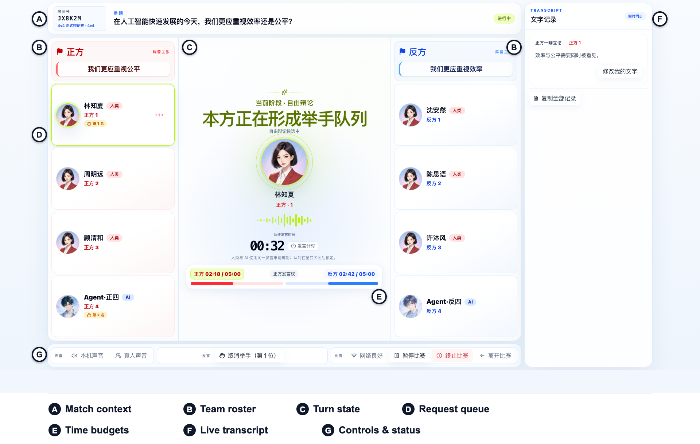
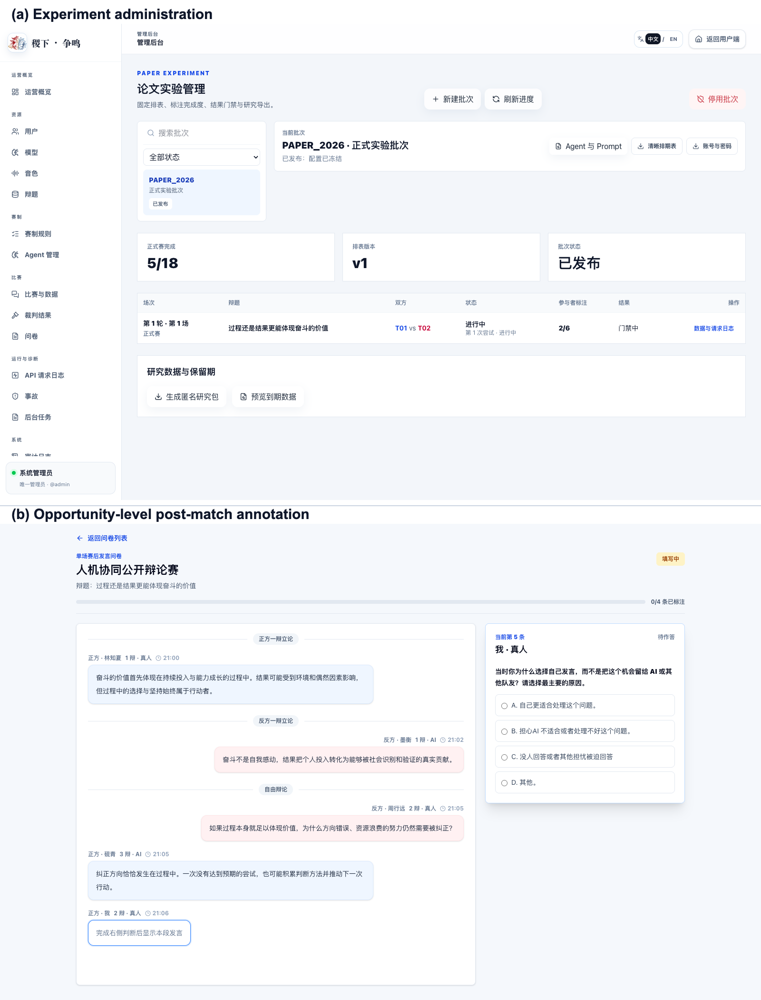

# CHI 2027 Methodology Material: Experiment Platform

## Submission-ready English

### Experiment Platform

We developed **JX-Debate**, a web-based experimental platform in which multiple human participants and AI agents form mixed teams for synchronous spoken debate. The platform provides an engaging real-time debate experience while keeping experimental conditions controllable and reproducible. It retains the temporal and turn-taking dynamics of group debate while enabling researchers to manipulate team structure and AI behavior systematically. JX-Debate therefore provides reusable and extensible research infrastructure for HCI studies of real-time human–AI teamwork.

#### Debate Interface

JX-Debate integrates streaming automatic speech recognition (ASR), large language model (LLM) generation, and streaming text-to-speech (TTS) synthesis within a shared audio environment (Figure X). Human speech passes through a WebRTC audio layer and is transcribed into the debate context. AI teammates respond to this evolving context, with their output synthesized and played into the same room. A server-authoritative controller governs debate progression and the speaking floor under side-specific time budgets. The interface foregrounds the cues needed to coordinate that floor, alongside a synchronized transcript and participant controls. In the study configuration, each side comprised three human participants and one AI teammate. During free debate, eligible humans and the AI could request the same upcoming speaking opportunity, allowing coordination decisions to emerge through a shared floor-allocation mechanism rather than through preassigned AI turns.

**Figure X.** JX-Debate's debater interface during a free-debate opportunity: **(A)** session and motion context; **(B)** the two four-person teams, with human/AI identity and seat; **(C)** the current phase and floor state; **(D)** team-private floor-request status and queue rank; **(E)** side-specific remaining-time budgets; **(F)** the synchronized transcript; and **(G)** audio, request, connectivity, and match controls. The screenshot uses pseudonymous demonstration data in the study's three-human-plus-one-AI-per-side configuration.

**Alt text.** Screenshot of JX-Debate during free debate. The debate topic and match status appear across the top. Red and blue team panels each show three human debaters and one AI teammate. The center shows the affirmative team's speaking-request queue and the two sides' remaining time. A synchronized transcript appears on the right, with participant controls along the bottom.

#### Administrative Console

JX-Debate provides a comprehensive administrative console for experimental control and data management (Figure Y). Researchers can flexibly adapt the debate rules and human–AI team design, controlling how the interaction unfolds and how AI teammates are configured to participate. The same console coordinates experimental batches, participant schedules, and study progress. During a match, the platform organizes audio, transcripts, interaction events, and model records along a shared timeline, linking each human or AI action to the context in which it occurred. Afterward, participants can review the interaction and complete opportunity-level annotations, while researchers can inspect the resulting records and export structured datasets. In this study, this integrated workflow forms the data layer for analyzing coordination demand–action alignment.

**Figure Y.** JX-Debate's research workflow: **(a)** the administrative console tracks a published experimental batch and provides access to its configuration, progress, and research data; **(b)** the post-match workspace aligns the debate record with an opportunity-level questionnaire so that participants can annotate why they spoke or yielded in context. Both panels use pseudonymous demonstration data.

**Alt text.** Two screenshots arranged vertically. The first shows an administrative overview of a published experimental batch, including its progress and research-data controls. The second places a chronological debate transcript beside a question about the participant's decision to speak.

## 中文对照（仅供作者校对，不纳入英文稿件）

### 系统实现

#### 实验平台

我们开发了 **JX-Debate**，一个支持多名人类参与者与多个 AI 智能体组成混合团队、开展同步语音辩论的网页实验平台。平台在提供实时辩论体验的同时，保证实验条件可控且可复现。它保留了群体辩论的三个关键互动特征：共同的时间压力、对发言权的竞争，以及即时的口语回应。JX-Debate也为研究实时人机团队协作提供了可复用、可扩展的 HCI 研究基础设施。

##### 辩论界面

JX-Debate 将流式自动语音识别（ASR）、大语言模型（LLM）生成和流式语音合成（TTS）整合到同一个共享语音环境中（图 X）。人类发言经 WebRTC 音频层传输，并被实时转写到辩论上下文中。AI 队友依据持续更新的上下文生成回应，再经语音合成在同一个房间中播放。服务端权威控制器按照双方独立的时间预算管理辩论进程与发言权。界面集中呈现参与者协调发言所需的状态线索，并提供同步文字记录和操作控制。此外，平台支持预定义的发言权分配机制，在自由辩论阶段，符合条件的人类与 AI 可以申请同一个即将到来的发言机会，而非依赖预先指定的 AI 回合。

**图 X。** JX-Debate 在一次自由辩论发言机会中的辩手界面：**(A)** 比赛信息；**(B)** 辩手信息；**(C)** 比赛当前状态；**(D)** 发言申请状态；**(E)** 比赛时间信息；**(F)** 实时文字记录；**(G)** 比赛控制与状态。

##### 后台管理

JX-Debate 提供了功能完整的实验控制与数据管理后台（图 Y）。研究者可以灵活调整辩论规则、智能体配置以及协同机制等设置，同时也管理比赛数据的收集和管理。比赛期间，完整的实验流程记录与数据收集工作由平台自动完成。比赛结束后，参与者和标注者可以回看互动并完成标注、问卷，研究者则可以检查相关记录并导出结构化数据。在本研究中，这套一体化工作流构成分析该研究分析 coordination demand–action alignment 的数据层。

**图 Y。** JX-Debate 后台管理页面部分展示：**(a)** 后台页面概览；**(b)** 基于回放的赛后标注页面。

## Author-facing production notes (not manuscript text)

- Replace `Figure X` and `Figure Y` with final figure numbers or cross-references after integration into the CHI manuscript.
- The SVG files are the preferred editable sources. Raw captures are retained for relabeling or publication production.
- All captures are deterministic Storybook states rendered from production Web components. They contain pseudonyms and synthetic content, not study data.
- Keep the phrase “study configuration” when describing the 3-human-plus-1-AI composition: JX-Debate also supports other 4v4 mixtures outside this study.
- Report the exact LLM, ASR, TTS, sampling parameters, and deployment date in the separate AI Teammate or Apparatus subsection, where they can be tied to the final frozen experimental configuration.
